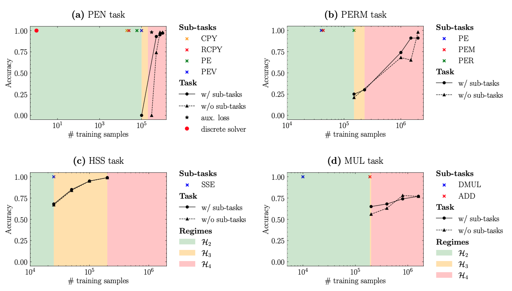

# Limitations of Language Models for Algorithmic Compositional Learning 

#### Jonathan Thomm, Giacomo Camposampiero, Aleksandar Terzic, Michael Hersche, Bernhard Schölkopf, Abbas Rahimi
Accepted as Conference Paper at the Thirty-eighth Annual Conference on Neural Information Processing Systems (NeurIPS) 2024. 

[[Paper]](https://arxiv.org/abs/2402.05785) | [[Presentation]](https://example.com)

<div align="center">
  
</div>


This repository contains the code for the paper "Limits of Transformer Language Models on Learning
to Compose Algorithms" (NeurIPS 2024), including generation code for the tasks introduced in the paper and the prompting experiments.

To run our code, you can use the `conda|mamba` environment provided in `environment.yml`.
To create and activate the environment, use
```
mamba env create -f environment.yml
mamba activate pythonenv
```

For generating data, please see `generate_data_example.py` and all config files that start with 'training_...'.
For running prompting experiments, see `run_prompting_experiments.py` and all configs with 'prompting' in the name.


## Citation 📚
If you use the work released here for your research, please consider citing our paper:
```
@inproceedings{thomm2024limits,
  title={Limits of transformer language models on learning to compose algorithms},
  author={Thomm, Jonathan and Camposampiero, Giacomo and Terzic, Aleksandar and Hersche, Michael and Sch{\"o}lkopf, Bernhard and Rahimi, Abbas},
  booktitle={The Thirty-eighth Annual Conference on Neural Information Processing Systems},
  year={2024}
}
``` 


## License 🔏
Please refer to the LICENSE file for the licensing of our code.

